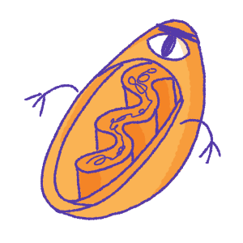
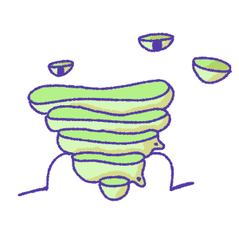
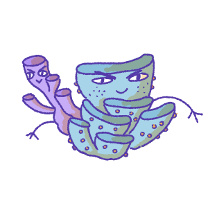

# Cellular Adventure
Biology Game for HenHacks2024

## Devpost Link:
https://devpost.com/software/cellular-adventure?ref_content=user-portfolio&ref_feature=in_progress

## Group Members
Tristan Dendorfer: tdendorf@udel.edu  
Jason Domingo: jayprdom@udel.edu  
James Gatonye: jamegato@udel.edu  
Winnie Li: winnie@udel.edu

## Instructions

---
| Game Element                              | Description                                                                                                            |
|:------------------------------------------|:-----------------------------------------------------------------------------------------------------------------------|
|    | The player plays as a student.   Use the A and D keys to move the player left and right.                  |
|  | It is I, the nucleus that stores DNA into structures called chromosomes.   Want to defeat me? Then you better answer my questions correctly.          |
|   | Coming Soon!                  |
|   | Coming Soon! |
|   | Coming Soon!   |